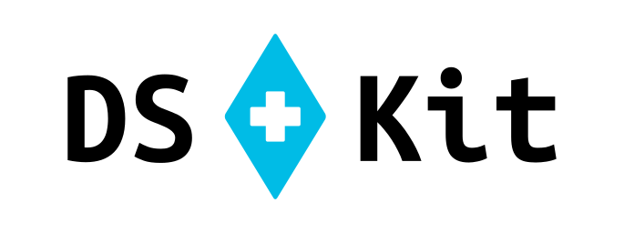
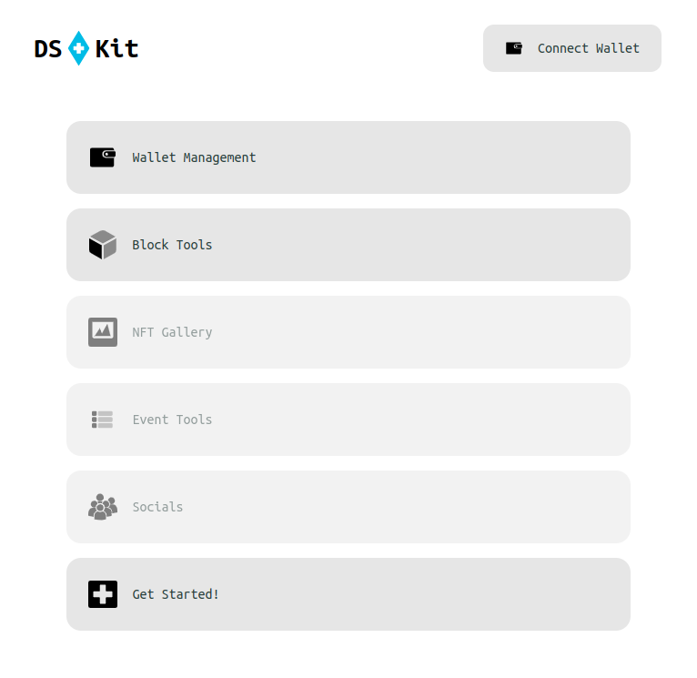

<span id="header"></span>


_A lightweight **"Dapp Survival Kit"** to help applications deliver fully functional experiences **without** sacrificing decentralization, security or privacy_

---

## Contents

- [Quick Start](#quick-start)
- [Modules](#modules)
  - [Swaps](#swaps)
  - [Prices](#prices)
  - [Zaps](#zaps)
  - [Blocks](#blocks)
  - [More](#more-to-come)
- [Why DSKit?](#why-dskit)
- [Bringing the "D" back to "Dapp"](#bringing-the-d-back-to-dapp)
- [Demo Site](#demo-site)

---

## Quick Start

### Installation

```cli
npm i dskit-eth
```

### Using with an RPC

```js
import { DSKit } from 'dskit-eth'

const dskit = new DSKit({ rpcUrl: 'https://your-privacy-respecting-rpc/' })
```

### Using with Viem

```js
import { DSKit } from "dskit-eth"
import { createPublicClient } from "viem"

const dskit = new DSKit({
  viemPublicClient: createPublicClient({ ... })
})
```

_More Provider Support Coming Soon..._

---

## Modules

### Swaps

Swap or get quotes from one token to another without any external APIs. Current market support includes UniswapV3 pairs with plans to integrate Uniswap V2, Velodrome, Aerodrome, Ramses, and more.

#### Example:

```js
// Get a quote and swap tx data for USDC -> WETH on Optimism
const swap = await dskit.swap.route({
  tokenIn: { address: '0x0b2C639c533813f4Aa9D7837CAf62653d097Ff85', decimals: 6, amount: 10n ** 8n }, // USDC
  tokenOut: { address: '0x4200000000000000000000000000000000000006', decimals: 18 }, // WETH
  executionOptions: {
    recipient: '0xbE4FeAE32210f682A41e1C41e3eaF4f8204cD29E'; // Recipient of the WETH
    slippage: 0.001; // 0.1% slippage
  }
})
const quoteAmountWeth = swap.quote
const swapRequest = swap.request
```

---

### Prices

Get token prices for your dapp using live onchain market data.

#### Example:

```js
// Price of WETH in USDC on Optimism
const priceOfWethInUsdc = await dskit.price.ofToken({
  token: {
    address: '0x4200000000000000000000000000000000000006',
    decimals: 18
  },
  tokenDenominator: {
    address: '0x0b2C639c533813f4Aa9D7837CAf62653d097Ff85',
    decimals: 6
  }
})
```

---

### Zaps

Zap native ETH or tokens into other tokens and bundle actions together.

#### Example:

```js
// Zap from native ETH on Optimism into the PoolTogether Prize USDC vault.
// This performs 3 steps in one tx:
//  1. wraps ETH to WETH
//  2. swaps WETH to USDC
//  3. deposits USDC to przUSDC as an additional action
import { dolphinAddress, zapRouter } from 'dskit-eth'
import { parseAbi } from 'viem'

const nativeEth = {
  address: '0xeeeeeeeeeeeeeeeeeeeeeeeeeeeeeeeeeeeeeeee', // use this for native ETH
  decimals: 18,
  amount: 10n ** 12n
}

const usdc = {
  address: '0x0b2C639c533813f4Aa9D7837CAf62653d097Ff85',
  decimals: 6
}

const zapTx = await dskit.zap.tx({
  tokenIn: nativeEth,
  swapTo: usdc,
  action: {
    address: '0x03D3CE84279cB6F54f5e6074ff0F8319d830dafe',
    abi: parseAbi(['function deposit(uint256,address) returns (uint256)']),
    functionName: 'deposit',
    args: [0n, zapRouter[10]],
    injectedAmountIndex: 4 // replaces the first arg with the output from the swap
  },
  tokenOut: { address: '0x03D3CE84279cB6F54f5e6074ff0F8319d830dafe', minAmount: 1n },
  userAddress: '0xbE4FeAE32210f682A41e1C41e3eaF4f8204cD29E'
})

const config = zapTx.config
const gasEstimate = zapTx.gasEstimate
const zapRequest = zapTx.request
const route = zapTx.route
```

---

### Blocks

Provides block tooling for fetching a block within (or close to) a given
timestamp range.

#### Examples

```js
const block = await dskit.block.nearTimestamp({
  targetTimestamp: Math.floor(Date.now() / 1000) - 86_400_000, // yesterday
  targetRangeSeconds: 60
})
const blockNumber = block.number
```

---

### More to Come...

- Event Indexing and Queries
- Web3 Social Integrations
- NFT tooling

---

## Why DSKit?

**Third party dependencies** have become commonplace in dapps, but many of these services have significant privacy concerns when it comes to gathering data about their users, and inherently introduce additional dependency risk and fail-points. The number of dapps that would fail if Coingecko, Covalent or Etherscan went down for a few hours or were blocked by a user's ISP is - in our opinion - concerning.

**Domain security** in web3 has been a huge point of failure causing consumers massive losses due to domain takeovers or phishing attacks. Enabling a future where dapps can focus on client-side infrastructure rather than server-side or back-end infrastructure allows dapps to be easily distributed through alternative hosting methods, such as IPFS, Arweave or otherwise. Dapps should not have users - users should have dapps.

---

## Bringing the "D" back to "Dapp"

DSKit offers functionality previously only easily accessible through third party services and APIs, but through a single data access point: an RPC. This includes features like finding swap routes, arbitrary zap routes such as zapping into ERC4626 vaults, finding token prices, fetching block data given a specific timestamp, event and transaction indexing, and more.

This increases a dapp's resilience to third party service updates and failures, and assures the user of the privacy of their data. Furthermore, a dapp can easily utilize a network connection specified by the user (ideally linked to their own locally hosted node), at which point the user has a standalone application where all onchain data is being accessed through a source they trust. In such a dapp, a user can have complete confidence that the only data they are publishing is the data they sign onchain.

---

## Demo Site

Check DSKit in action on the [DSKit Demo Site](https://demo.dskit.eth.limo/)!


